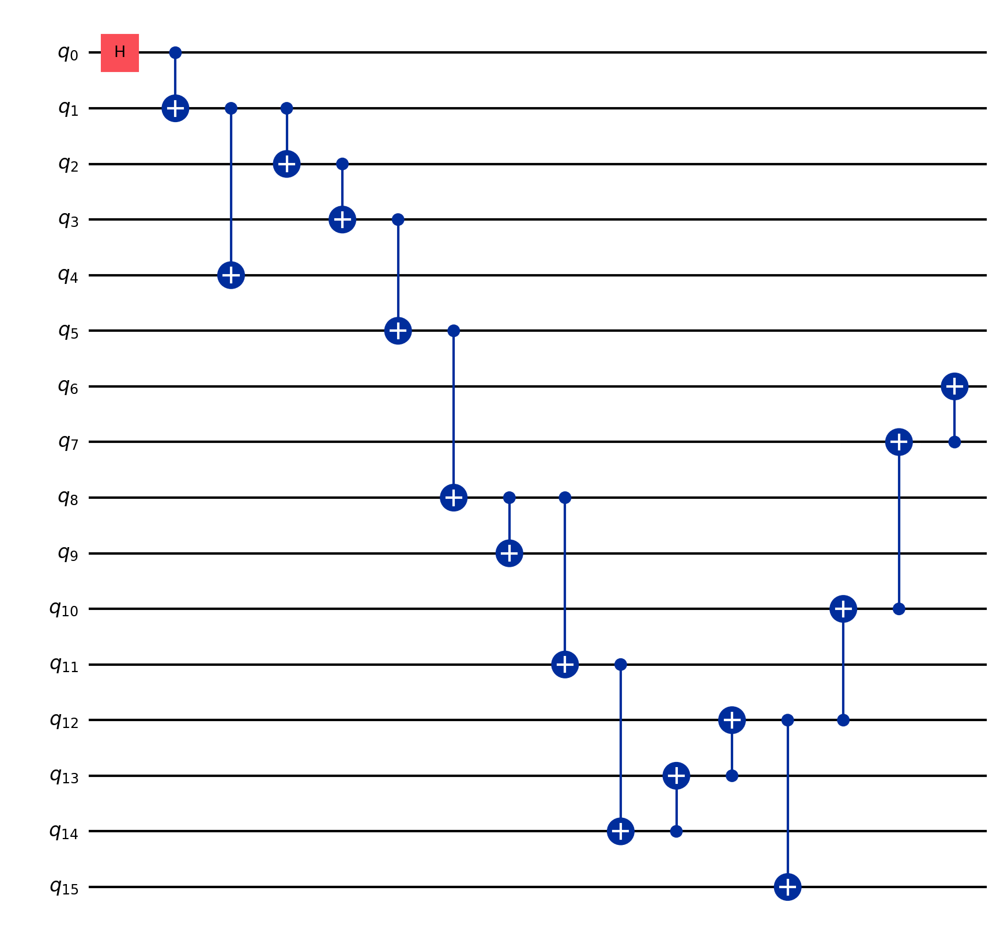
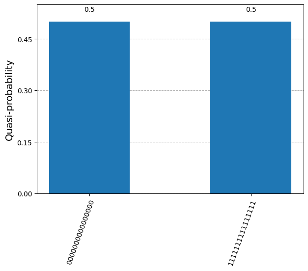

# GHZ

This repo contains some tests on creating `GHZ` states using [Qiskit](https://www.ibm.com/quantum/qiskit).

For this project, the idea was to explore some different techniques to create big `GHZ states`.

The techniques I used were:

- circuit knitting
- topology mapping
- circuit transpilation (using Qiskit `PassManager` and `Sampler`)

In total, 4 circuits were built mixing some of theses techniques.

## Circuits

### 5 qubits GHZ - [notebook](./circuit-cutting-test.ipynb)

This one was the first test done with circuit knitting, using the `cutqc` module from `circuit knitting toolbox` package.

Here the circuit was cut in 2 separated parts, measured and them joined together.

| cuts                                          |  exported data                                                        |
|-----------------------------------------------|-----------------------------------------------------------------------|
|[subcircuit 0](./5-qubits-GHZ-subcircuit-0.qpy)|[cuts](./5-qubits-GHZ-cuts.json)                                       |
|[subcircuit 1](./5-qubits-GHZ-subcircuit-1.qpy)|[probabilities](./5-qubits-GHZ-probs.json)                             |
|                                               |[reconstructed probabilities](./5-qubits-GHZ-reconstructed-probs.json) |

### 16 qubits GHZ - [notebook](./16-qubits-ghz-circuit-knitting.ipynb)

The second is a 16 qubits circuit, following the topology of IBM's Guadalupe backend. After mapping each qubit connection, the resulting distribution after simulating was:

This one, was also cut using `cutqc` giving the following results:

| cuts                                           |  exported data                                                        |
|------------------------------------------------|-----------------------------------------------------------------------|
|[subcircuit 0](./16-qubits-GHZ-subcircuit-0.qpy)|[cuts](./16-qubits-GHZ-cuts.json)                                      |
|[subcircuit 1](./16-qubits-GHZ-subcircuit-1.qpy)|[probabilities](./16-qubits-GHZ-probs.json)                            |
|[subcircuit 2](./16-qubits-GHZ-subcircuit-2.qpy)|[reconstructed probabilities](./16-qubits-GHZ-reconstructed-probs.json)|

## 28 qubits GHZ

The 28 qubits version was based on IBM's Cambridge backend, however this one wasn't executed due to hardware issues.
Nevertheless, some cuts were done.

| cuts                                           |  exported data                                                        |
|------------------------------------------------|-----------------------------------------------------------------------|
|[subcircuit 0](./28-qubits-GHZ-subcircuit-0.qpy)|[cuts](./28-qubits-GHZ-cuts.json)                                      |
|[subcircuit 1](./28-qubits-GHZ-subcircuit-1.qpy)|[probabilities](./28-qubits-GHZ-probs.json)                            |
|[subcircuit 2](./28-qubits-GHZ-subcircuit-2.qpy)|                                                                       |
|[subcircuit 3](./28-qubits-GHZ-subcircuit-3.qpy)|                                                                       |

## 127 qubits GHZ

The biggest one, is based on IBM's Osaka backend. This one, was transpiled and executed on real hardware, the outcomes was the following:

